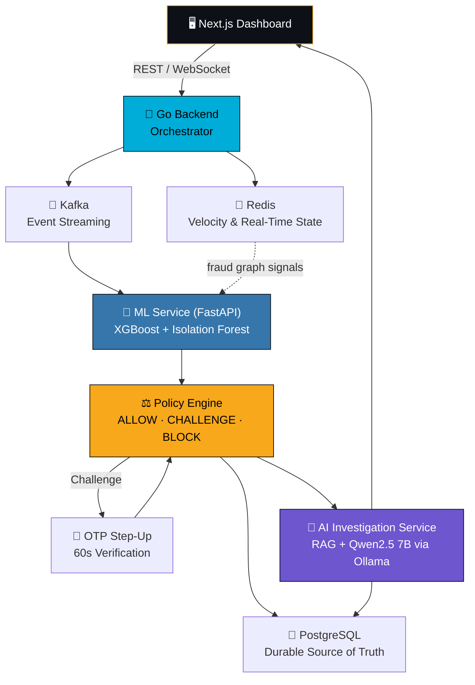

<div align="center">


# ⚡ VULCAN SHIELD

### Adaptive AI Risk Management Platform for Real-Time Payment Fraud Defense


<br/>

[](https://youtu.be/usaufl6fst0)


</div>

---

## 🩸 The Problem: Payment Fraud Is a Moving Target

Every real-time payments network fights the same war on multiple fronts at once — and getting any single front wrong is expensive.

<table>
<tr>
<td width="50%" valign="top">

**❌ False Positives**
Legitimate customers get blocked or challenged. Every wrongful decline erodes trust and kills conversion — genuine users abandon the platform.

**❌ False Negatives**
Fraudulent transactions slip through a static rule engine because they don't match a known signature. The cost lands directly on the merchant or the platform.

**⚡ Velocity Attacks**
Dozens of transactions fired from the same card, device, or IP within seconds — designed to overwhelm naive per-transaction checks before anyone notices the pattern.

</td>
<td width="50%" valign="top">

**🕵️ Account Takeover**
A legitimate account, hijacked. New device, new IP, unfamiliar spending pattern — the transaction "looks normal" in isolation but is completely inconsistent with the account's own history.

**✈️ Impossible Travel**
A login from Bengaluru followed by a transaction from a location that couldn't physically be reached in the elapsed time — a classic signal that static amount/velocity rules miss entirely.

**🕸️ Coordinated Fraud Rings**
Device farms and shared IPs linking many accounts together. Individually each transaction looks harmless — the fraud only becomes visible when you look at the *relationships*, not just the transaction.

</td>
</tr>
</table>

The common thread: **fraud is contextual and relational, not just numerical.** A single risk score is never enough — you need behavior, history, network relationships, and human-readable reasoning all working together, in real time, without slowing the transaction down.

---

## 🛡️ The Solution: Vulcan Shield

> **ML predicts. Policy decides. AI investigates and explains. The fraud graph reveals relationships.**

Vulcan Shield is a full-stack, real-time transaction risk platform that mirrors how a mature fintech risk stack actually works — not a single model bolted onto a UI, but a pipeline of specialized systems, each with one clear job, wired together through an event-driven backbone.

<div align="center">



</div>

At a glance: a transaction is generated, streamed through Kafka, enriched with real-time behavioral signals from Redis and a fraud relationship graph, scored by two independent ML models, and handed to a deterministic policy engine that decides the outcome. If the case is suspicious, a local LLM investigator picks it up afterward — retrieving real evidence and producing an explainable, evidence-backed report for a human analyst, without ever being allowed to touch the actual authorization decision.

---

## 🏗️ Architecture Deep Dive

### 🖥️ Next.js — The Command Center
The dashboard is where the whole system becomes visible: a live transaction stream, per-transaction risk breakdowns, an interactive fraud-network graph, scenario controls to trigger attack simulations on demand, and the OTP/investigation UI. It is a pure reflection layer — it renders decisions the backend has already made and never carries fraud logic of its own.

### 🐹 Go Backend — The Orchestrator
The Go service is the spine of the platform. It owns the transaction lifecycle end-to-end: generating synthetic transactions for demo scenarios, producing/consuming Kafka events, maintaining velocity and behavioral state in Redis, calling the ML and AI services, and — critically — running the **deterministic policy engine** that is the single authority for every `ALLOW / CHALLENGE / BLOCK` decision. It also manages the simulated OTP step-up flow, complete with a 60-second expiry window and risk re-evaluation on completion, and writes every decision to an immutable audit trail in PostgreSQL. Nothing outside the Go layer can authorize a payment.

### 🧠 ML Service — Two Models, One Verdict
A FastAPI service hosts two purpose-built models that answer two different questions:

- **XGBoost** — a supervised classifier trained on synthetic transaction history, answering *"does this look like known fraud?"* and returning a fraud probability.
- **Isolation Forest** — an unsupervised anomaly detector answering *"does this behavior look unusual?"*, catching novel patterns that have no historical label to learn from.

Their outputs are combined into a single risk score alongside **SHAP-based explanations** that surface exactly which features (velocity, device reuse, network relationships, amount deviation) drove the score — feeding a policy engine that stays fully auditable and never has to guess *why* a model said what it said.

### 🤖 AI Investigation Service — The Analyst in the Loop
This is where a local **Ollama-hosted Qwen2.5 7B Instruct** model earns its place. Once the policy engine has already made its call, the LLM is dispatched — asynchronously, off the critical path — to *investigate* flagged transactions: pulling structured customer/device/IP history through typed, read-only tools, retrieving similar historical fraud cases and playbooks via RAG (pgvector), and synthesizing all of it into a structured, schema-validated report with evidence, a risk narrative, and a recommendation. It is explicitly barred from inventing evidence, overriding the policy engine, or ever becoming the transaction's decision-maker — its only job is to explain, in plain language, *why* the numbers say what they say.

### 🕸️ The Fraud Graph — Relationships Over Records
Devices, IPs, cards, and accounts are modeled as a relationship graph rather than isolated rows. A single device linked to nine accounts, or an IP shared across three prior fraud cases, becomes a visible, explorable pattern on the dashboard — and those same relationships are converted into numerical features (`device_account_count`, `ip_account_count`, `fraud_neighbor_count`) that flow straight back into the ML layer, so the graph isn't just a pretty picture — it actively sharpens every prediction.

### ⚡ Redis + 📨 Kafka — Speed and Decoupling
Redis handles everything that needs to be fast and short-lived: sliding velocity windows, device/IP activity counters, and temporary OTP state — the real-time nervous system that catches a velocity attack the instant it starts. Kafka decouples transaction generation from downstream processing, propagating domain events (`transaction.created`, `risk.evaluated`, `challenge.completed`, `ai.investigation.completed`) so the pipeline stays resilient and independently scalable.

---

## 🎬 See It In Action

<div align="center">

[](https://youtu.be/usaufl6fst0)

**[▶ Watch the full demo on YouTube](https://youtu.be/usaufl6fst0)**

</div>

---

## 🧭 The Core Mantra

<div align="center">

```
ML predicts risk.
Policy decides the action.
Redis catches it in real time.
The fraud graph exposes what's hidden.
A local LLM investigates and explains the evidence.

Nothing overrides the policy engine — not even the AI.
```

</div>

<div align="center">


Built with 🔥 for the **Razorpay AI Buildathon**

</div>
